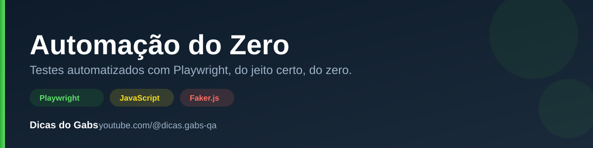

<p align="center">
  
</p>

<h1 align="center">Automação do Zero</h1>

<p align="center">
  Projeto de testes automatizados com <strong>Playwright</strong>, construído
  episódio a episódio na série <strong>Automação do Zero</strong>, no canal
  <a href="https://youtube.com/@dicas.gabs-qa"><strong>Dicas do Gabs</strong></a>.
</p>

<p align="center">
  
  
  
  
</p>

---

## Sobre o projeto

Este repositório acompanha a série **Automação do Zero**, no YouTube. A cada
episódio, o projeto evolui — sempre ao vivo, na tela, editando o código real.
Não é um projeto "pronto desde o início": ele começa simples e vai ganhando
boas práticas conforme os episódios avançam.

A aplicação testada é um app fictício de biblioteca ("Hub de Leitura"), usado
como playground pra ensinar Playwright na prática.

## Stack

- **[Playwright Test](https://playwright.dev/)** — framework de testes end-to-end
- **JavaScript** (sem TypeScript, de propósito — foco em quem está começando)
- **[Faker.js](https://fakerjs.dev/)** — geração de dados dinâmicos para os testes

## Estrutura

```
aulaGabs/
├── pages/          # Page Objects — 1 arquivo por tela da aplicação
├── tests/          # Specs do Playwright
├── fixtures/       # Fixtures customizadas (test.extend) e geradores de dados
└── playwright.config.js
```

Padrão seguido no projeto: **1 Page Object = 1 tela**. Cada página da
aplicação (login, registro, etc.) tem seu próprio arquivo em `pages/`, com
getters para os locators e métodos para as ações do usuário.

## Como rodar

Pré-requisitos: [Node.js](https://nodejs.org/) instalado, e a aplicação
testada rodando localmente (`localhost:3000`).

```bash
# instalar dependências
npm install

# instalar os browsers do Playwright
npx playwright install

# rodar todos os testes
npx playwright test

# rodar um arquivo especifico, com navegador visivel
npx playwright test tests/criarUsuario.spec.js --project=chromium --headed

# gerar codigo automaticamente navegando na aplicacao
npm run codegen
```

## A série

**Automação do Zero** ensina automação de testes do absoluto zero, com foco
em boas práticas profissionais desde o primeiro episódio: Page Object Model,
fixtures, assertions de verdade, e os padrões que times de QA usam de
verdade no dia a dia.

Assista no canal: **[youtube.com/@dicas.gabs-qa](https://youtube.com/@dicas.gabs-qa)**

---

<p align="center">
  Feito com 🧪 por <strong>Dicas do Gabs</strong>
</p>
